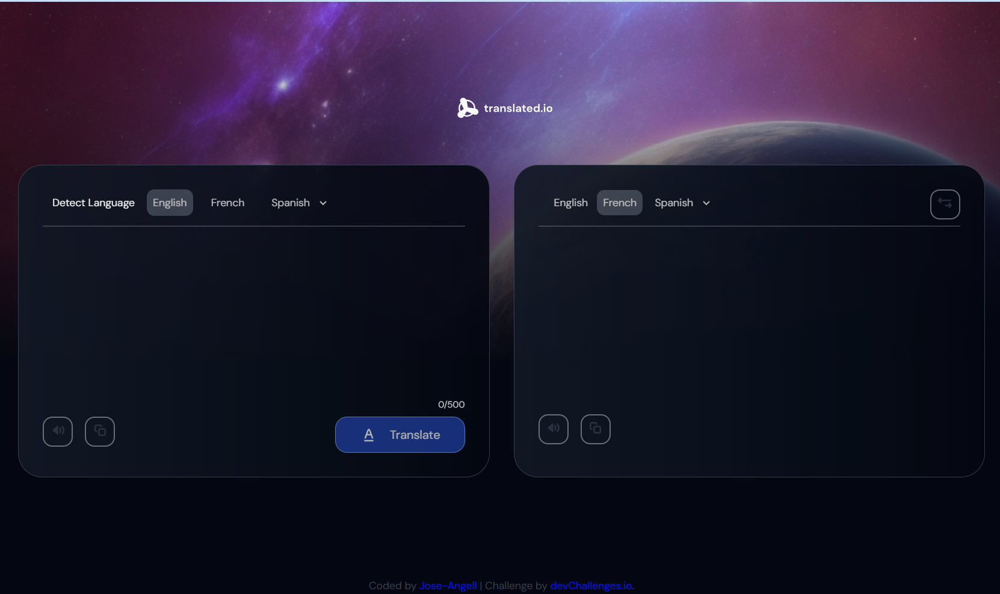

<!-- Please update value in the {}  -->

<h1 align="center">Simple-Translate-App | devChallenges</h1>

   Solution for a challenge <a href="https://devchallenges.io/challenge/translate-app" target="_blank">Translate app</a> from <a href="http://devchallenges.io" target="_blank">devChallenges.io</a>.

  <h3>
    <a href="https://jose-angell.github.io/-simple-translate-app/">
      Demo
    </a>
     | 
    <a href="https://github.com/jose-angell/-simple-translate-app">
      Solution
    </a>
     | 
    <a href="https://devchallenges.io/challenge/translate-app">
      Challenge
    </a>
  </h3>

<!-- TABLE OF CONTENTS -->

## Table of Contents

- [Overview](#overview)
  - [What I learned](#what-i-learned)
  - [Useful resources](#useful-resources)
- [Built with](#built-with)
- [Features](#features)
- [Contact](#contact)
- [Acknowledgements](#acknowledgements)

<!-- OVERVIEW -->

## Overview
Este proyecto es una aplicacion basica de traduccion, se implementa la api mymemory.translated.net para realizar las traducciones. la aplicacion realiza una traduccion basica y solo permite 500 caracteres por solicitud.

### What I learned

 En este proyecto tube la oportunidad de practicar el uso de api's, y de poner en practicas algunos recursos de accesibilidad
que ayudan a la navegacion de pagina
### Useful resources

- [w3schools](https://www.w3schools.com/html/html_accessibility.asp) - Este tutorial contine informacion sobre accesibilidad en aplicaciones we

### Built with

<!-- This section should list any major frameworks that you built your project using. Here are a few examples.-->

- Semantic HTML5 markup
- CSS custom properties
- Flexbox
- CSS Grid

## Features

<!-- List the features of your application or follow the template. Don't share the figma file here :) -->

This application/site was created as a submission to a [DevChallenges](https://devchallenges.io/challenges-dashboard) challenge.

## Acknowledgements

<!-- This section should list any articles or add-ons/plugins that helps you to complete the project. This is optional but it will help you in the future. For exmpale -->

## Author

- GitHub [jose-angell](https://github.com/jose-angell)
